# MuJoCo Playground: can you operate robots?

**3 missions. 3 robots. Real physics in your browser.** A humanoid hunts a nuclear leak, two arms contain a
virus, a rover looks for life on Mars. Every run is scored and seeded, so it doubles as a small
locomotion / manipulation / navigation benchmark.

**[▶ Play it](https://mujoco-playground-alpha.vercel.app)** · [Deploy your own on Vercel](#deploy-on-vercel) · [Embed it](#embed-it-on-a-website) · [Code tour](#code-tour)

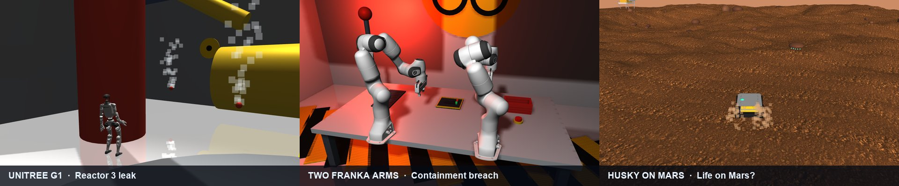

Everything runs client-side: [MuJoCo](https://mujoco.org) compiled to WebAssembly (`@mujoco/mujoco`) for physics,
[three.js](https://threejs.org) for rendering, [onnxruntime-web](https://onnxruntime.ai) for the G1's learned walking
policy. There is no server, so any static host works.

| | Robot | Mission | Controls |
|---|---|---|---|
| 1 | **Unitree G1** humanoid | Reactor 3 is leaking: find the radioactive leaks, flag them, report back | `W A S D` walk, `F` flag, `G` undo, `Enter` report, `Space` jump |
| 2 | **Two Franka Panda arms** | Containment breach: relay 4 virus sample tubes into a biohazard case and seal it | `Tab` switch arm, `W A S D R F` move, `Q E` wrist, `Space` gripper |
| 3 | **Clearpath Husky** on Mars | Life on Mars? Collect the sample and bring it home using only the rover's own SLAM map | `W S` drive, `A D` steer, hold `E` collect, `M` map |

`Esc` returns to the mission select, `B` replays the story briefing, `?seed=N` in the URL (or **New seed**) changes the scenario.

---

## The missions

Each mission opens with a short, skippable **storyboard** ([see below](#storyboard-intros)): the story, a camera fly-through of
the scene, what to do and how it is scored.

### 1. Reactor 3 leak: Unitree G1, nuclear plant

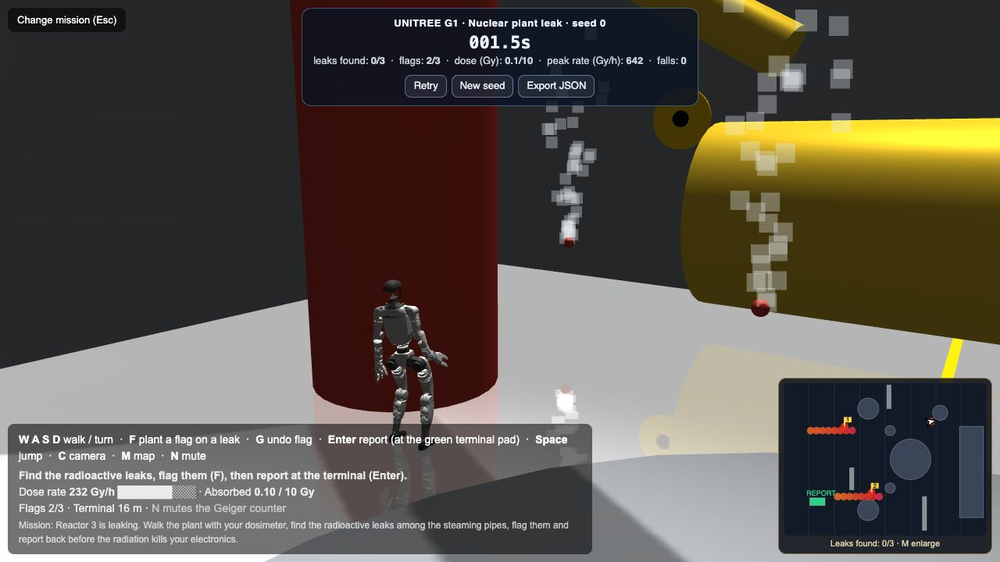

*Halcyon Nuclear Plant, Unit 3. Primary coolant is venting somewhere in the reactor hall, the crew is evacuated, and the only thing
that can go in is a robot with a dosimeter on its chest.*

- **Objective.** Six pipe couplings steam; three of them (picked by the seed) are radioactive. Walk the hall, find the three
  leaks, plant a flag next to each (`F`), then return to the green pad at the control terminal and press `Enter` to file the report.
- **Physics.** The G1 walks with a real pretrained policy from
  [unitree_rl_gym](https://github.com/unitreerobotics/unitree_rl_gym) (an LSTM exported to ONNX, `scripts/g1/export_policy.py`)
  running at 50 Hz in the browser. If it falls it is stood back up where it fell; each fall costs points.
- **Radiation model** (`web/src/robots/g1/radiation.js`). Dose rate = background + `A / (r² + ε)` per leak, multiplied by 0.12 for every
  concrete shield wall and 0.05 for the reactor's bio-shield that lies between you and the leak. You read it on a gauge, hear it
  as a Geiger counter (Poisson clicks, `geiger.js`), and see it painted along your path on the plan map. Steam is vented at *all* six
  couplings, so steam alone gives nothing away.
- **Dose budget.** The robot's electronics tolerate 10 Gy. Stand next to a leak and it dies in seconds ("electronics fried by
  radiation"); triangulate from a few metres instead. Flags must land within 3.5 m of a leak.
- **World.** A procedurally built plant (`scripts/g1/build_plant.py`): reactor vessel, steam generators, pressurizer, turbine, coolant
  pumps, primary and secondary piping, shield walls and a control terminal. Only the floor and the outer walls collide, because the
  walking policy was trained on flat ground and trips on obstacles.

| The robot up close | Radiation survey (enlarged plan map) |
|---|---|
| 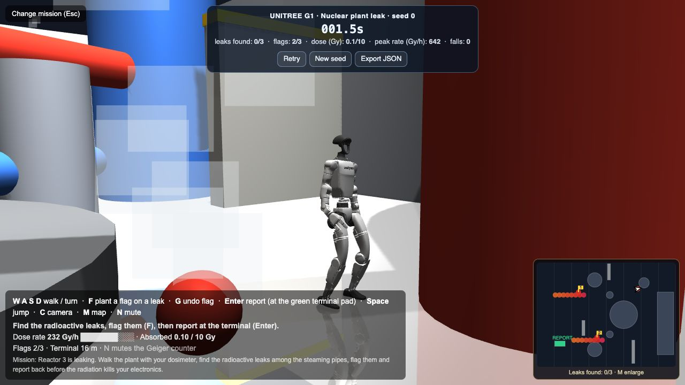 | 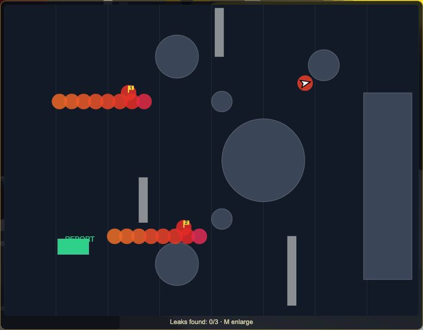 |

**Score (max 100).** 22 per leak found + 9 for filing the report + (if all three found) up to 10 for speed and 15 for dose left, minus 3 per fall.

### 2. Containment breach: two Franka arms, BSL-4 biohazard lab

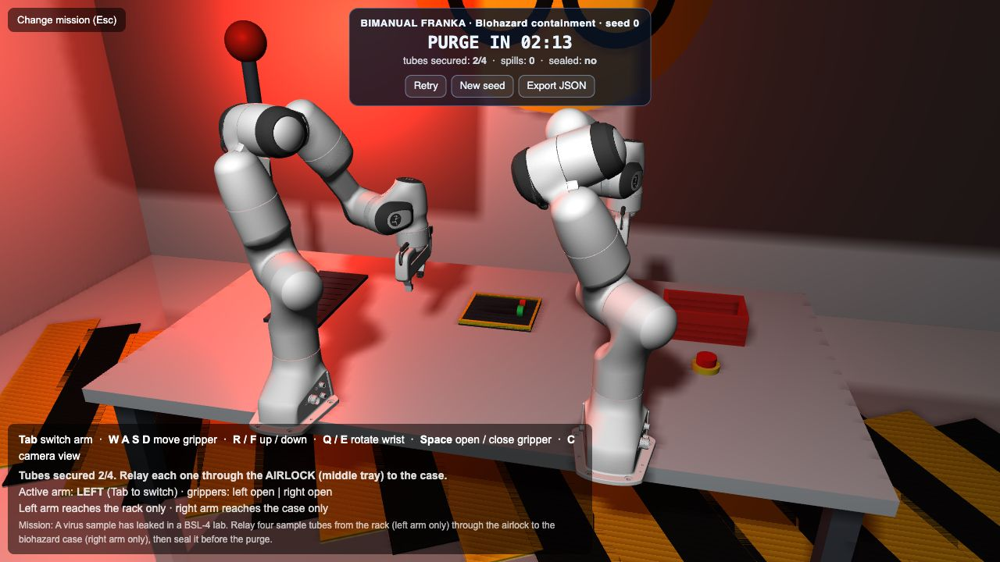

*A sample of the engineered NX-7 virus has leaked. Staff are out, and the building purge starts in four minutes. Anything left on the
bench goes to the incinerator, including the only samples that could lead to a vaccine.*

- **Objective.** Four tubes sit in a rack on the far left, where **only the left arm** can reach. The biohazard case is on the far
  right, where **only the right arm** can reach. They meet at the **airlock** tray in the middle: the left arm sets a tube down, the
  right arm picks it up and drops it into the case. Drop all four, then press the red **SEAL** button with a closed gripper.
- **Physics.** Two [Franka Panda](https://github.com/google-deepmind/mujoco_menagerie) arms driven by damped-least-squares inverse
  kinematics on MuJoCo site Jacobians (`web/src/robots/franka/controller.js`). You move a Cartesian target for the active arm with the
  keyboard; the hand grasps with real contact friction (condim-6 contacts, ~15 N per finger). Held tubes are carried at a capped speed so
  they do not slip out. A tube that leaves the bench is a spill (-10).
- **Why handing over through a tray?** A mid-air handover of a thin tube twists it out of an off-centre grasp. Real BSL labs use pass-through
  airlocks for exactly this reason.
- **Verified.** A scripted operator that looks at the tube positions and uses whichever arm can reach each one secured all 4 tubes and sealed
  the case with zero spills (score 94, 153 s) in the same physics you play with. Grasps are not guaranteed: if a tube slips, pick it up again.
- **Alarm.** A red beacon pulses, the floor is hazard-taped, a biohazard sign hangs on the wall, and the clock counts **down** ("PURGE IN 03:12").

| Close-up of the relay | Lab overview |
|---|---|
| 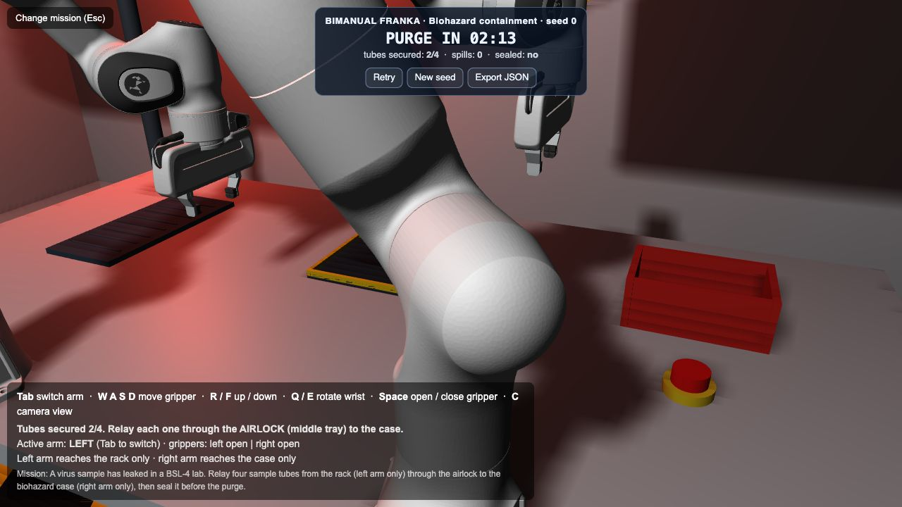 | 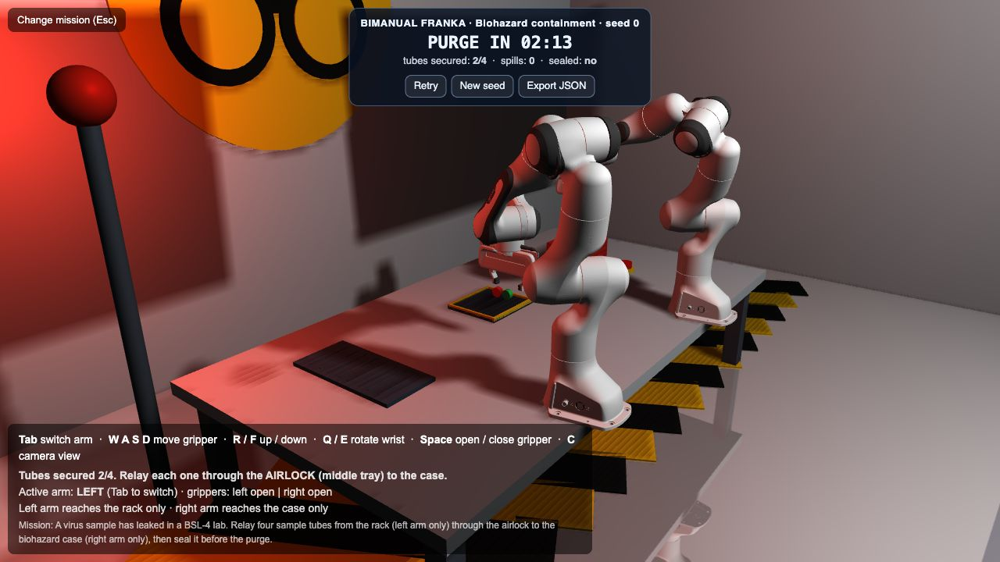 |

**Score (max 100).** 17 per tube secured + 22 for sealing + up to 10 for speed, minus 10 per spill. Success = 4 tubes in the case and sealed.

### 3. Life on Mars?: Clearpath Husky with SLAM

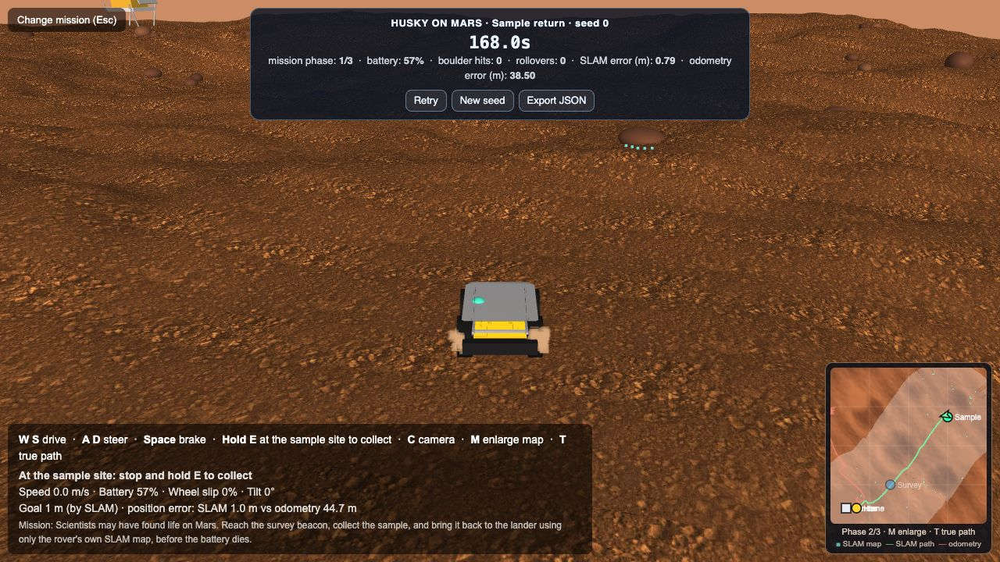

*Sol 1,247, Jezero Crater. An orbiter found a methane plume and a patch of layered, spotted rock that looks like a fossil microbial mat.
If it is what it looks like, it is the first evidence of life beyond Earth. Lander AURORA-1 set down 40 m away; its only mobile asset is Husky-1.*

- **Objective.** Reach the blue survey beacon, drive to the green sample site, hold `E` for 3 s to drill and cache the core, then return to the
  yellow beacon at the lander before the battery runs out.
- **Real Mars ground.** The terrain is textured with a real NASA photograph of Martian gravel (Curiosity's Mars Descent Imager, PIA16018,
  flat-fielded and tiled, `scripts/husky/make_mars_texture.py`) over a procedural heightfield with craters, rims, dunes and fine-scale
  roughness, plus 70 boulders. Gravity is Mars gravity (3.71 m/s²).
- **Real Husky.** Clearpath's Husky meshes, mass (46 kg) and geometry (skid-steer, 0.55 m track, 0.165 m wheels), speed-limited to about 1 m/s with
  realistic acceleration. Battery (a mission pack with idle and motor power), wheel slip, tilt and rollovers are simulated and shown on the HUD.
  Dust is kicked up by the wheels.
- **SLAM** (`web/src/robots/husky/slam.js`). No GPS on Mars, so the rover builds its own map:

  | Piece | What it does |
  |---|---|
  | Lidar | 270°, 270 beams, 20 m, front-mounted; ray-marches the real terrain and boulders with range noise and dropouts |
  | Wheel odometry | The naive baseline: integrates wheel speeds. Dust slip makes it drift by tens of metres |
  | Visual odometry + gyro | What the SLAM prediction actually uses (speed over ground from a downward camera, yaw rate from a gyro with bias) |
  | Scan matching | Correlative matcher (Hector-SLAM style) against the occupancy map built so far, corrects the prediction every 0.125 s |
  | Occupancy grid | 0.15 m log-odds grid drawn on top of the orbital image on the in-game map |

  The HUD shows both errors live. In a scripted run, SLAM kept the position error to about 1 to 3 m RMS while wheel odometry drifted to more than
  38 m. It is a 2D scan matcher without loop closure, so it can still get lost where there are few boulders to see.
- **Map.** An orbital image (relief only), your SLAM map in cyan, SLAM path (green) versus odometry (red), beacons and your estimated position.
  `M` enlarges it and `T` reveals the true path.

| SLAM map | Wide view |
|---|---|
| 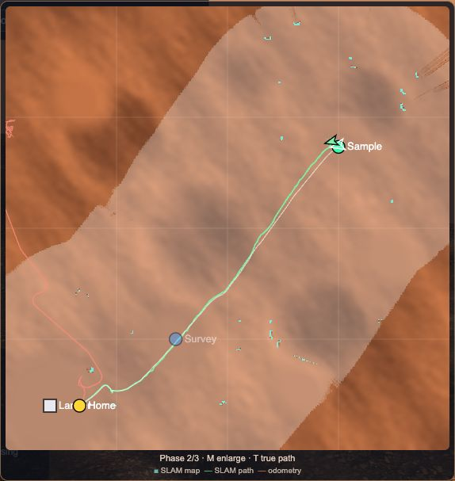 | 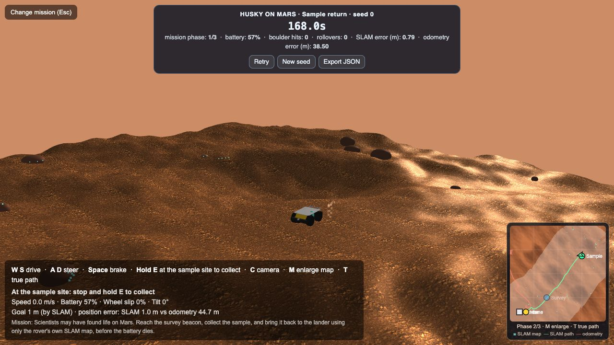 |

**Score (max 100).** 30 per mission phase (survey, sample, home) + up to 10 for speed, minus 2 per boulder hit and 5 per rollover. A flat battery ends the run.

---

## Storyboard intros

When a mission loads you get a short storyboard: a camera fly-through of the real scene, a typed narration card, an alarm glow where the
story calls for one, and the controls. `Space` / `Enter` moves on, `Esc` skips, `B` replays it mid-mission. It plays once per mission per
session; add `?skipstory=1` to the URL to skip it. Stories are plain data (`web/src/robots/*/story.js`):

```js
{ kicker: "Sol 1,247 · Jezero Crater, Mars", title: "The signal", stamp: "BIOSIGNATURE?",
  text: "An orbiter has found a methane plume...",
  cam: { pos: m2t(x, y, z), target: m2t(x, y, z) } }   // m2t converts MuJoCo (z up) to three.js (y up)
```

| G1 | Franka | Husky |
|---|---|---|
| 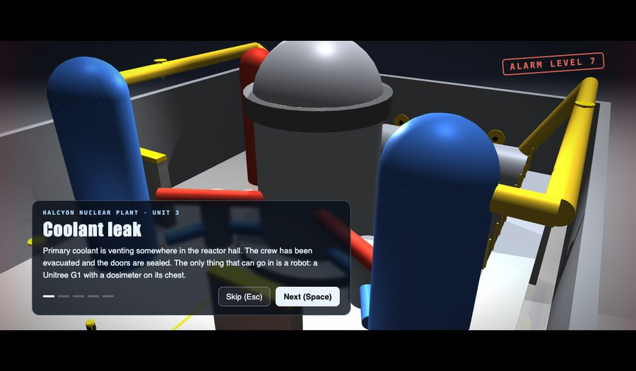 | 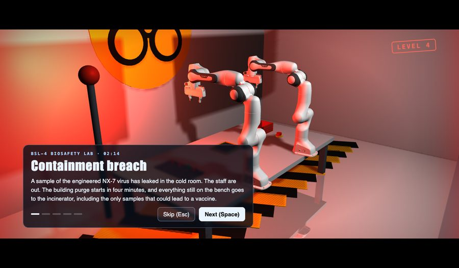 | 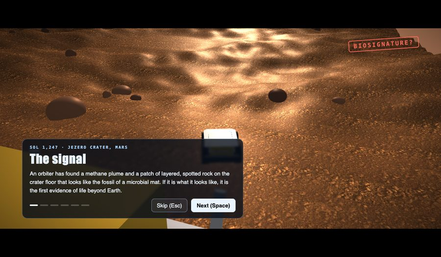 |

---

## Benchmark

Every environment implements one small interface (`web/src/core/bench.js`): a seeded `reset`, a clock that starts at your first input,
`isSuccess`, a 0 to 100 `score` and `getMetrics`. The panel at the top has **Retry**, **New seed** and **Export JSON**.

| Env | Seed controls | Success | Notable metrics |
|---|---|---|---|
| G1 plant | which 3 of 6 couplings leak, leak strengths | all 3 leaks flagged and reported | leaks found, dose (Gy), peak rate, falls |
| Franka lab | which tube sits in which slot, small offsets | 4 tubes in the case and sealed | tubes secured, spills, sealed |
| Husky Mars | which of 4 sample sites, start heading | sample collected and returned to the lander | phase, battery, boulder hits, rollovers, SLAM and odometry RMS error |

```json
{ "benchmark": "mujoco-playground", "version": 1, "env": "rover", "seed": 3, "success": true, "time_s": 92.4,
  "score": 98, "metrics": { "mission phase": "3/3", "battery": "46%", "SLAM error (m)": "1.21", "odometry error (m)": "38.50" } }
```

---

## Run it locally

```bash
git clone https://github.com/pgeedh/mujoco-playground && cd mujoco-playground/web
npm install
npm run build                       # copies the runtime into web/dist (what Vercel serves)
cd dist && python3 -m http.server 8080
# open http://localhost:8080
```

For development you can also serve `web/` directly (it loads dependencies from `node_modules`):
`cd web && npm install && python3 -m http.server 8080`. Add `?debug` to show the lil-gui debug panel.

Python side (optional): `pip install -r requirements.txt`. `scripts/g1/test_world.py` checks the G1 model balances in plain MuJoCo.

## Deploy on Vercel

The app is a static site. A root `vercel.json` tells Vercel how to build it:

```json
{ "framework": null, "installCommand": "cd web && npm install", "buildCommand": "cd web && npm run build", "outputDirectory": "web/dist" }
```

1. Push this repo to your GitHub (fork it).
2. In Vercel: **Add New → Project → Import** your fork.
3. **Framework Preset: Other.** (Important: the repo has a `requirements.txt`, so Vercel may guess *Python* and fail with
   `No python entrypoint found`. `"framework": null` in `vercel.json` already forces this, but set it in the UI too if you see that error.)
4. Leave **Root Directory** as `./` and leave the build/output overrides **off**; `vercel.json` supplies them. (If you set Root Directory to
   `web`, `web/vercel.json` is used instead and works the same way.)
5. **Deploy.** The build log should end with `built dist/`.
6. Production deploys come from your **Production Branch** (Settings → Git). Other branches get preview URLs.

CLI alternative: `npm i -g vercel && vercel` (preview) and `vercel --prod`.

Notes: the deployed folder is about 140 MB (robot meshes and the WebAssembly runtime). It is fine on Vercel's free plan; scenes download
lazily, only when a mission is picked. If you ever need it lighter, delete a mission from `web/src/core/envs.js` and its folder in
`web/assets/scenes`. The site sets no framing restrictions, so it can be iframed.

## Embed it on a website

`?embed=1` loads nothing until a visitor picks a mission, fits small frames, and stops game keys scrolling the host page:

```html
<iframe src="https://YOUR-APP.vercel.app/?embed=1" width="100%" height="560"
        style="border:0;border-radius:12px" allow="fullscreen" loading="lazy" title="MuJoCo Playground"></iframe>
```

In Framer: **Insert → Embed**, paste the snippet (or use the URL option), and make the block at least 520 px tall. The visitor clicks a
mission card once to give the frame keyboard focus.

## Use World Labs worlds as backdrops

Drop a world exported from [World Labs](https://www.worldlabs.ai) (Marble) or any glTF into `web/assets/worlds/<env id>/`
(`g1`, `franka` or `rover`) with a `world.json`:

```json
{ "file": "scene.glb", "position": [0, 0, 0], "rotation": [0, 0, 0], "scale": 1, "hide": ["tree1"] }
```

It is shown as the visual backdrop (three.js coordinates, y up); `hide` lists MuJoCo body names whose stand-in visuals should be hidden.
Physics still comes from the MuJoCo scene, so add collision geometry for anything you want to touch.

---

## Code tour

The code is split by robot. `core/` is shared; each robot has its own folder with its controller, mission logic and story.

```
web/
├─ index.html                      HUD containers, import map
├─ vercel.json / scripts/build.mjs  static build for Vercel (copies runtime deps into dist/)
├─ assets/
│  ├─ policy/g1_walk_policy.onnx    the G1's pretrained walking policy
│  ├─ scenes/g1_plant/              G1 + the nuclear plant         (plant.xml, plant_mission.json, G1 meshes)
│  ├─ scenes/franka_lab/            two Pandas + the biohazard lab (biolab.xml, Panda meshes)
│  └─ scenes/rover_mars/            Husky + Mars                   (mars.xml, heightmap, NASA ground texture)
└─ src/
   ├─ main.js                       renderer, scene switching, cameras, render/physics loop
   ├─ mujocoUtils.js                MuJoCo → three.js scene conversion (vendored, trimmed from zalo/mujoco_wasm)
   ├─ core/
   │  ├─ envs.js                    registry: one entry per mission (scene, camera, help, story key, time limit)
   │  ├─ bench.js                   seeded reset, clock, scoring panel, JSON export
   │  ├─ briefing.js, stories.js    storyboard engine and story lookup
   │  ├─ menu.js                    mission select
   │  ├─ sceneLoader.js             downloads a scene's files into MuJoCo's virtual filesystem
   │  └─ worlds.js                  optional World Labs / glTF backdrops
   └─ robots/
      ├─ g1/       controller.js (walking policy, jump, falls) · nuclear.js (mission) · radiation.js · geiger.js · plantMap.js · story.js
      ├─ franka/   controller.js (IK teleop of two arms + the biohazard mission) · story.js
      └─ husky/    controller.js (driving, battery, mission) · slam.js (lidar, odometry, scan matching) · minimap.js · story.js
scripts/
├─ make_manifests.py               lists each scene's files for the browser
├─ g1/       build_plant.py (the plant world) · export_policy.py (TorchScript → ONNX) · test_world.py
├─ franka/   build_biolab.py (the lab, from the Menagerie Panda)
└─ husky/    build_mars.py (terrain, boulders, Husky) · make_mars_texture.py (NASA photo → tiling texture)
```

Every robot controller exposes the same hooks to `main.js`: `bindModel`, `load`, `reset(data, seed)`, `beforeStep(data, dt)`, `update(data)`
and the benchmark methods (`hasInput`, `isSuccess`, `getMetrics`, `score`, optionally `isFailed`/`isFinished`).

### Add your own mission

1. Build a scene XML (a script like `scripts/franka/build_biolab.py` is a good template) and run `python scripts/make_manifests.py`.
2. Write a controller in `web/src/robots/<name>/` implementing the hooks above.
3. Add an entry to `web/src/core/envs.js` (scene, camera, help text, time limit, `story` key) and a story in `web/src/core/stories.js`.

### Regenerating the assets

```bash
python scripts/g1/build_plant.py && python scripts/franka/build_biolab.py && python scripts/husky/build_mars.py
python scripts/husky/make_mars_texture.py   # needs scripts/husky/data/PIA16018.jpg
python scripts/make_manifests.py
```

## Honest notes

- The G1 walks with a real policy, but jumps are scripted (no public jump policy exists) and the arms are held in a fixed pose. The policy was
  trained on flat ground, so the plant's equipment is visual only.
- Franka grasping uses real friction but is not guaranteed; the airlock relay is deliberately forgiving, and a missed grasp can be retried.
- The Husky's lidar, camera odometry and gyro are *simulated sensors* over the true physics state. The SLAM is a 2D scan matcher with no loop closure.
- The leak activities, dose limits and the biohazard story are fiction for the game; the Mars ground photograph and the robot models are real.

## Credits and licenses

- **Ground photo**: NASA/JPL-Caltech/MSSS, *Gravel-Covered Martian Surface* (PIA16018), Mars Descent Imager on Curiosity. NASA media are free to use with credit.
- **Unitree G1** and **Franka Panda** MJCF and meshes: [MuJoCo Menagerie](https://github.com/google-deepmind/mujoco_menagerie) (BSD-3 and Apache-2.0, see `LICENSE` files in `web/assets/scenes`).
- **Clearpath Husky** meshes: [husky/husky](https://github.com/husky/husky) (BSD-3, `web/assets/scenes/rover_mars/LICENSE_husky`).
- **Walking policy**: [unitree_rl_gym](https://github.com/unitreerobotics/unitree_rl_gym) (BSD-3).
- **Task design** for stacking-style checks follows [robosuite](https://github.com/ARISE-Initiative/robosuite); scene conversion is trimmed from [zalo/mujoco_wasm](https://github.com/zalo/mujoco_wasm).
- [MuJoCo](https://mujoco.org), [three.js](https://threejs.org), [onnxruntime-web](https://onnxruntime.ai).
